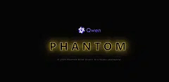
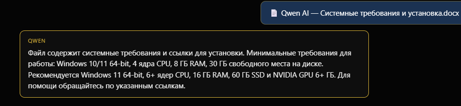
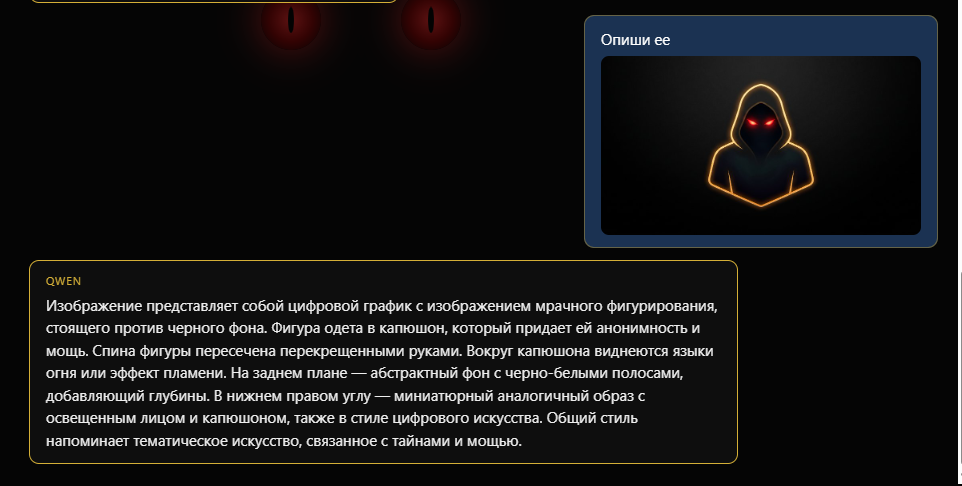
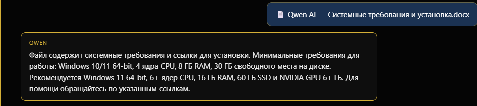

# Phantom Road Studio

**Локальный AI-ассистент** на базе Qwen, Claude и Alice. Работает **без интернета** через [Ollama](https://ollama.com).

---

## ✨ Возможности

- 🧠 **Три ассистента:** Qwen, Claude, Alice — у каждого своя память и свои чаты
- 📄 **Читает документы:** `.txt`, `.md`, `.json`, `.docx`, `.pdf`, `.xlsx`, `.csv`
- 🖼 **Распознаёт картинки** — описывает, что видит (через llava)
- 🎵 **Играет музыку** со встроенным плеером
- 💾 **Память на диске** — переживает обновления и перезапуски
- 🔄 **Автообновление интерфейса** с GitHub — тихое, в фоне
- 🚫 **Работает без интернета** — после первичной установки

---

## 📸 Скриншоты

### Главный экран

### Диалог с ассистентом

### Распознавание картинок

### Встроенный плеер

---

## 📋 Требования

- **Windows** 10 или 11 (64-bit)
- **[Ollama](https://ollama.com/download)** — установлена локально
- Модели в Ollama:
  - `qwen2.5` — основной ассистент
  - `llava` — распознавание картинок
  - `mistral` — ассистент Claude

---

## 🚀 Установка

1. **Установи Ollama** → https://ollama.com/download

2. **Скачай модели** (в PowerShell):
